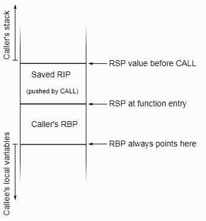
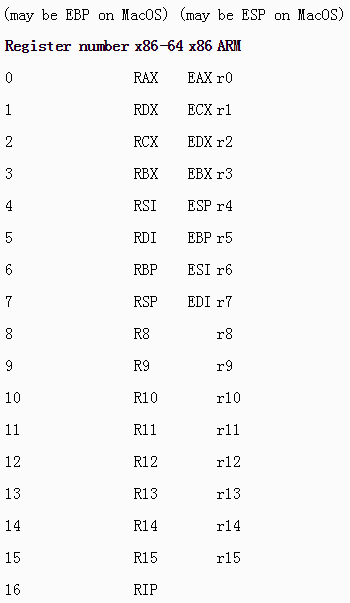

# [CFI directives in assembly files](https://www.imperialviolet.org/2017/01/18/cfi.html)

from: [ImperialViolet](https://www.imperialviolet.org)

18 Jan 2017


(This post uses x86-64 for illustration throughout. The fundamentals are similar for other platforms 
but will need some translation that I don't cover here.)

Despite compilers getting better over time, it's still the case that hand-written assembly can be 
worthwhile for certain hot-spots. Sometimes there are special CPU instructions for the thing that 
you're trying to do, sometimes you [need detailed control of the resulting code][1] and, to some 
extent, it remains possible for *some* people to out-optimise a compiler.

[1]: http://link.springer.com/chapter/10.1007/978-3-319-48965-0_36

But hand-written assembly doesn't automatically get some of the things that the compiler generates 
for normal code, such as debugging information. Perhaps your assembly code never crashes (although 
any function that takes a pointer can suffer from bugs in other code) but you probably still care 
about accurate profiling information. In order for debuggers to walk up the stack in a core file, or 
for profilers to correctly account for CPU time, they need be able to unwind call frames.

Unwinding used to be easy as every function would have a standard prologue:

```asm
push rbp
mov rbp, rsp
```

This would make the stack look like this (remember that stacks grow *downwards* in memory):



So, upon entry to a function, the CALL instruction that jumped to the function in question will have 
pushed the previous program counter (from the RIP register) onto the stack. Then the function 
prologue saves the current value of RBP on the stack and copies the current value of the stack 
pointer into RBP. From this point until the function is complete, RBP won't be touched.

This makes stack unwinding easy because RBP always points to the call frame for the current 
function. That gets you the saved address of the parent call and the saved value of its RBP and so 
on.

The problems with this scheme are that a) the function prologue can be excessive for small functions 
and b) we would like to be able to use RBP as a general purpose register to avoid spills. Which is 
why the [GCC documentation][2] says that “-O also turns on -fomit-frame-pointer on machines where 
doing so does not interfere with debugging”.  This means that you can't depend on being able to 
unwind stacks like this. A process can be comprised of various shared libraries, any of which might 
be compiled with optimisations.

To be able to unwind the stack without depending on this convention, additional debugging tables are 
needed. The compiler will generate these automatically (when asked) for code that it generates, but 
it's something that we need to worry about when writing assembly functions ourselves if we want 
profilers and debuggers to work.

The reference for the assembly directives that we'll need is [here][3], but they are very lightly 
documented. You can understand more by reading the [DWARF][4] spec, which documents the data that 
is being generated. Specifically see sections 6.4 and D.6. But I'll try to tie the two together in 
this post.

[2]: https://gcc.gnu.org/onlinedocs/gcc/Optimize-Options.html
[3]: https://sourceware.org/binutils/docs/as/CFI-directives.html
[4]: http://www.dwarfstd.org/doc/DWARF4.pdf

The tables that we need the assembler to emit for us are called **Call Frame Information (CFI)**. (Not 
to be confused with Control Flow Integrity, which is very different.) Based on that name, all the 
assembler directives begin with `.cfi_`.

Next we need to define the **Canonical Frame Address (CFA)**. This is the value of the stack pointer 
just before the CALL instruction in the parent function. In the diagram above, it's the value 
indicated by “RSP value before CALL”. Our first task will be to define data that allows the CFA to 
be calculated for any given instruction.

The CFI tables allow the CFA to be expressed as a register value plus an offset. For example, 
immediately upon function entry the CFA is `RSP + 8`. (The eight byte offset is because the CALL 
instruction will have pushed the previous RIP on the stack.)

As the function executes, however, the expression will probably change. If nothing else, after 
pushing a value onto the stack we would need to increase the offset.

So one design for the CFI table would be to store a (register, offset) pair for every instruction. 
Conceptually that's what we do but, to save space, only changes from instruction to instruction are 
stored.

It's time for an example, so here's a trivial assembly function that includes CFI directives and a 
running commentary.

```asm
  .globl  square
  .type   square,@function
  .hidden square
square:
```

This is a standard preamble for a function that's unrelated to CFI. Your assembly code should 
already be full of this.

```asm
.cfi_startproc
```

Our first CFI directive. This is needed at the start of every annotated function. It causes a new 
CFI table for this function to be initialised.

```asm
.cfi_def_cfa rsp, 8
```

This is defining the CFA expression as a register plus offset. One of the things that you'll see 
compilers do is express the registers as numbers rather than names. But, at least with GAS, you can 
write names. (I've included a table of DWARF register numbers and names below in case you need it.)

Getting back to the directive, this is just specifying what I discussed above: on entry to a 
function, the CFA is at `RSP + 8`.

```asm
push    rbp
.cfi_def_cfa rsp, 16
```

After pushing something to the stack, the value of RSP will have changed so we need to update the 
CFA expression. It's now RSP + 16, to account for the eight bytes we pushed.

```asm
mov     rbp, rsp
.cfi_def_cfa rbp, 16
```

This function happens to have a standard prologue, so we'll save the frame pointer in RBP, following 
the old convention. Thus, for the rest of the function we can define the CFA as RBP + 16 and 
manipulate the stack without having to worry about it again.

```asm
mov     DWORD PTR [rbp-4], edi
mov     eax, DWORD PTR [rbp-4]
imul    eax, DWORD PTR [rbp-4]
pop     rbp
.cfi_def_cfa rsp, 8
```

We're getting ready to return from this function and, after restoring RBP from the stack, the old 
CFA expression is invalid because the value of RBP has changed. So we define it as RSP + 8 again.

```asm
ret
.cfi_endproc
```

At the end of the function we need to trigger the CFI table to be emitted. (It's an error if a CFI 
table is left open at the end of the file.)

The CFI tables for an object file can be dumped with objdump -W and, if you do that for the example 
above, you'll see *two* tables: something called a CIE and something called an FDE.

The **CIE (Common Information Entry)** table contains information common to all functions and it's worth 
taking a look at it:

    … CIE
      Version:         1
      Augmentation:    "zR"
      Code alignment factor: 1
      Data alignment factor: -8
      Return address column: 16
      Augmentation data:     1b

      DW_CFA_def_cfa: r7 (rsp) ofs 8
      DW_CFA_offset: r16 (rip) at cfa-8

You can ignore everything until the `DW_CFA_`… lines at the end. They define CFI directives that are 
common to all functions (that reference this CIE). The first is saying that the CFA is at `RSP + 8`, 
which is what we had already defined at function entry. This means that *you don't need a CFI 
directive at the beginning of the function*. Basically `RSP + 8` is already the default.

The second directive is something that we'll get to when we discuss saving registers.

If we look at the FDE (Frame Description Entry) for the example function that we defined, we see 
that it reflects the CFI directives from the assembly:

    … FDE cie=…
      DW_CFA_advance_loc: 1 to 0000000000000001
      DW_CFA_def_cfa: r7 (rsp) ofs 16
      DW_CFA_advance_loc: 3 to 0000000000000004
      DW_CFA_def_cfa: r6 (rbp) ofs 16
      DW_CFA_advance_loc: 11 to 000000000000000f
      DW_CFA_def_cfa: r7 (rsp) ofs 8

The FDE describes the range of instructions that it's valid for and is a series of operations to 
either update the CFA expression, or to skip over the next *n* bytes of instructions. Fairly 
obvious.

### Optimisations for CFA directives

There are some shortcuts when writing CFA directives:

Firstly, you can update just the offset, or just the register, with `cfi_def_cfa_offset` and 
`cfi_def_cfa_register` respectively. This not only saves typing in the source file, it saves bytes 
in the table too.

Secondly, you can update the offset with a relative value using `cfi_adjust_cfa_offset`. This is 
useful when pushing lots of values to the stack as the offset will increase by eight each time.

Here's the example from above, but using these directives and omitting the first directive that we 
don't need because of the CIE:

```asm
  .globl  square
  .type   square,@function
  .hidden square
square:
  .cfi_startproc
  push    rbp
  .cfi_adjust_cfa_offset 8
  mov     rbp, rsp
  .cfi_def_cfa_register rbp
  mov     DWORD PTR [rbp-4], edi
  mov     eax, DWORD PTR [rbp-4]
  imul    eax, DWORD PTR [rbp-4]
  pop     rbp
  .cfi_def_cfa rsp, 8
  ret
  .cfi_endproc
```

#### Saving registers

Consider a profiler that is unwinding the stack after a profiling signal. It calculates the CFA of 
the active function and, from that, finds the parent function. Now it needs to calculate the parent 
function's CFA and, from the CFI tables, discovers that it's related to RBX. Since RBX is a callee-
saved register, that's reasonable, but the active function might have stomped RBX. So, in order for 
the unwinding to proceed it needs a way to find where the active function saved the old value of 
RBX. So there are more CFI directives that let you document where registers have been saved.

Registers can either be saved at an offset from the CFA (i.e. on the stack), or in another register. 
Most of the time they'll be saved on the stack though because, if you had a caller-saved register to 
spare, you would be using it first.

To indicate that a register is saved on the stack, use `cfi_offset`. In the same example as above 
(see the stack diagram at the top) the caller's `RBP` is saved at `CFA - 16` bytes. So, with saved 
registers annotated too, it would start like this:

```asm
square:
  .cfi_startproc
  push    rbp
  .cfi_adjust_cfa_offset 8
  .cfi_offset rbp, -16
```

If you need to save a register in another register for some reason, see [the documentation][5] for 
`cfi_register`.

If you get all of that correct then your debugger should be able to unwind crashes correctly, and 
your profiler should be able to avoid recording lots of detached functions. However, I'm afraid that 
I don't know of a better way to test this than to zero RBP, add a crash in the assembly code, and 
check whether GBD can go up correctly.

(None of this works for Windows. But Per Vognsen, via Twitter, notes that there are [similar 
directives][6] in MASM.)

[5]: https://sourceware.org/binutils/docs/as/CFI-directives.html
[6]: https://msdn.microsoft.com/en-us/library/ms235241.aspx
[7]: http://www.dwarfstd.org/doc/Dwarf3.pdf
[8]: https://gitlab-beta.engr.illinois.edu/ejclark2/linux/commit/eab9e6137f237681a04649e786cc4d942bedd6d1
[9]: http://www.dwarfstd.org/doc/Dwarf3.pdf
[10]: https://github.com/openssl/openssl/blob/master/crypto/perlasm/x86_64-xlate.pl

### CFI expressions

New in [version three][7] of the DWARF standard are CFI Expressions. These define a stack machine 
for calculating the CFA value and can be useful when your stack frame is non-standard (which is 
fairly common in assembly code). However, there's no assembler support for them that I've been able 
to find, so one has to use `cfi_escape` and provide the raw DWARF data in a .s file. As an example, 
see [this kernel patch][8].

Since there's no assembler support, you'll need to read section 2.5 of the [standard][9], then 
search for `DW_CFA_def_cfa_expression` and, perhaps, search for `cfi_directive` in OpenSSL's 
[perlasm script for x86-64][10] and the places in OpenSSL where that is used. Good luck.

(I suggest testing by adding some instructions that write to NULL in the assembly code and checking 
that gdb can correctly step up the stack and that info reg shows the correct values for callee-saved 
registers in the parent frame.)

### CFI register numbers

In case you need to use or read the raw register numbers, here they are for a few architectures:



(x86 values taken from page 25 of [this doc][11]. x86-64 values from page 57 of [this doc]. ARM 
taken from page 7 of [this doc][13].)

[11]: https://www.uclibc.org/docs/psABI-i386.pdf
[12]: https://www.uclibc.org/docs/psABI-x86_64.pdf
[13]: http://infocenter.arm.com/help/topic/com.arm.doc.ihi0040b/IHI0040B_aadwarf.pdf
